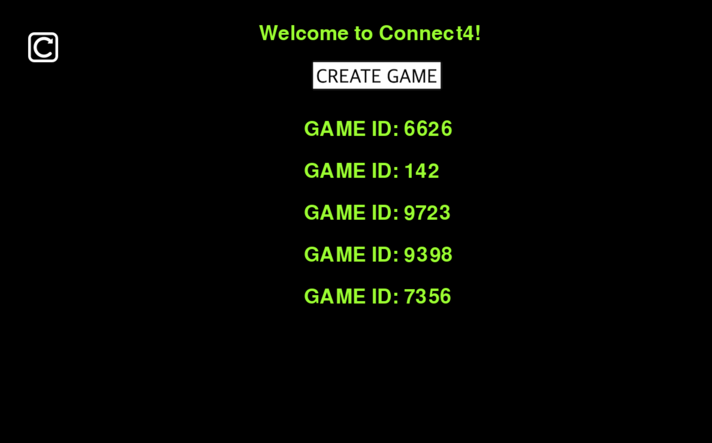
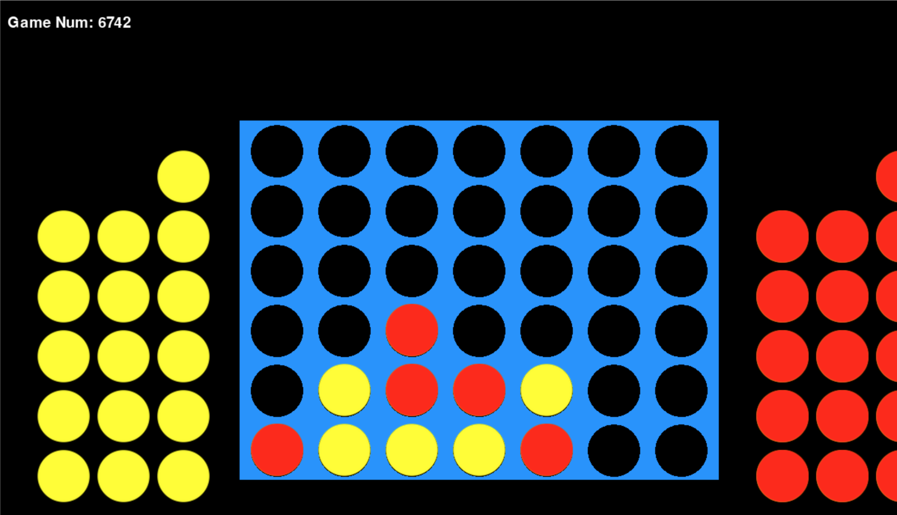

# Multiplayer Connect4

## Overview
This is a Multiplayer Connect4 game built using Python and AWS services, including API Gateway to facilitate real-time API calls to call Lambda Functions to interact with Dynamo DB as a database. The game allows players to compete against each other in real-time. It features a menu that displays all current open games, and if a player creates a new game, it will appear on this list.

### Current Open Games
Below is an illustration of the menu displaying the current open games. New games created by players will appear in this list.

### Waiting For Second Player
After creating a game, you will need to wait for another player to join. The game will be listed in the current open games menu until a second player connects.

### The Game
Once both players have joined, the gameplay begins.

